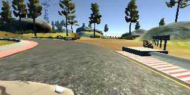

## **Behavioral Cloning** 

### Overview

---
This Behavioral Cloning project is part of the Udacity self-driving car program. See [here](https://github.com/udacity/CarND-Behavioral-Cloning-P3) for more details about this project.

In this project a car is trained using deep neural networks for self-driving in the Udacity provided simulator. The car will learn human's good driving behaviors from a dataset via a CNN model so that it can operater the steer properly. Finally, the car can drive autonomously and safetly on the track(s) in the simulator. 

The outline of this project is as follows:
* Use the simulator to collect data of good driving behavior
* Build a convolution neural network in Keras that predicts steering angles from images
* Train and validate the model with a training and validation set
* Test that the model successfully drives around track one without leaving the road
* Discuss further improvments in generalization


[//]: # (Image References)

[image1]: ./images/steering.png "Sample images (left)"


### Files
---
The project includes the following files:
* model.py containing the script to create and train the model
* drive.py for driving the car in autonomous mode
* model.h5 containing a trained convolution neural network 
* video.mp4 recording the car driving autonomously around the track one
* (this) README.md summarizing the project

Using the Udacity provided simulator and the drive.py file, the car can be driven autonomously around the track by executing 
```sh
python drive.py model.h5
```

### Dataset
---
The dataset used in this project is the Udacity sample dataset which contains 8,036 samples. Each sample includes three images taken by three cameras (i.e., the left, center and right cameras). Below are three images in one sample: 

<p align="middle">
  
  
     
</p>

In addtion, each sample contains information about steering angles, throttle, brake and speed. Only the steering angles are the targets in this project. Also, the angle values in the dataset are associated with the center images.  Below is the distribution of the angle values, showing the values are balanced in terms of 0.

<p align="middle">
  
</p>

Also, a correction is made on the steering angle for the left and right images, respectively. Thus, each sample in the dataset can generate three image/ steering angle pairs. Therefore, there are 8,036 * 3 sample pairs (i.e, input/target pairs) in the training set.


### Model Architecture and Training strategy
---
#### 1. CNN Architecture

A [VGG-like](https://arxiv.org/abs/1409.1556) CNN architecture was my initial attempt to seek a suitable model for this task. The samll filter size (3x3) and maxpooling (after every two convolutionay layers) were applied. Also, more neurons were employed in the fully-connected layers and the L2 regularizer was considered there. It didn't work well. After a few attempts with adjustments of hyperparameters, I turned to the [NAVIDIA model](https://arxiv.org/abs/1604.07316).

The final model consists of the following layers:

| Layer         		|     Description 	        								| 
|:---------------------:|:---------------------------------------------------------:| 
| Input         		| 160x320x3 RGB image   									|
| Normalization 		| mapping to [0, 1]											|
| Cropping				| 65x320x3 RGB image    									|
| Convolution 5x5     	| 2x2 stride, valid padding, outputs 31x158x3, 24 filters 	|
| RELU					|															|
| Convolution 5x5     	| 2x2 stride, valid padding, outputs 14x77x3, 36 filters 	|
| RELU					|															|
| Convolution 5x5     	| 2x2 stride, valid padding, outputs 5x37x3, 48 filters 	|
| RELU					|															|
| Dropout   	      	| drop rate: 0.5    										|
| Convolution 3x3     	| 1x1 stride, valid padding,  outputs 3x35x3, 64 filters 	|
| RELU					|															|
| Convolution 3x3     	| 1x1 stride, valid padding,  outputs 1x32x3, 64 filters 	|
| RELU					|															|
| Dropout               | drop rate: 0.5    										|
| Flatten	        	|  outputs 6,144     										|
| Fully connected		| inputs 6,144,   outputs 100        						|
| RELU					|															|
| Dropout               | drop rate: 0.5    										|
| Fully connected		| inputs 100,    outputs 50      							|
| RELU					|															|
| Dropout               | drop rate: 0.5    										|
| Fully connected		| inputs 50,    outputs 10      							|
| Fully connected		| inputs 10,    outputs 1       							|
|						|															|


This model is a modified version of the [NAVIDIA model](https://arxiv.org/abs/1604.07316)
with three dropout layers being added to the model to help reduce overfitting.
Note that this is a regression model with the loss function being the mean square error. 

The [Adam optimizer](https://keras.io/optimizers/) (with default parameters in Keras) is used to train the model.  

#### 2. Training

The original training dataset (containing 8,036 * 3 samples) was randomly splited to a training set (80%) and a validation set (20%). We chose the batch size 64 and ran 20 epochs. Both the training loss and validation loss were slowly decreasing and ended up with the low values.

I didn't store the data in memory all at once (though we were able to do so for this task on my working machine). Instead, I implemented a generator function and used the [fit_generator](https://keras.io/models/sequential/) in Keras. This is particularly helpful when your data cannot fit the memory.   

Also, images were randomly chosen to be fliped (horizontally) on the fly during the batch training. This can make the model not only obtain "new" data but see more balanced data.  


### Test
---
The autonomous car can drive safely around Track One in the simulator, as shown in the attached video file "video.mp4".

<!-- black line -->
<figure class="video_container">
    <video controls="true" allowfullscreen="true" poster="./images/video.jpg">
        <source src="video.mp4" type="video/mp4">
    </video>
</figure>
<!-- blank line -->


### Discussion
---
The project is just a baby step towards developing a more adavanced or complex model cloning human's driving behaviors. Note that we only consider the steering angle the output of the model. Further improvements in generalization include, for instance,
* collecting more data in various enviroments
* considering more outputs in the model (e.g., brake, speed)
* applying more image augmentation techniques

